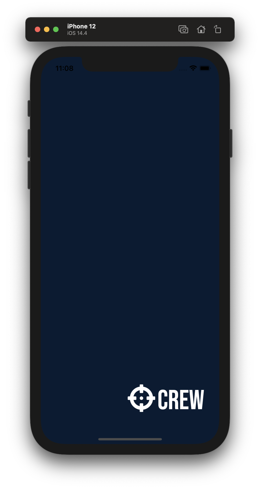
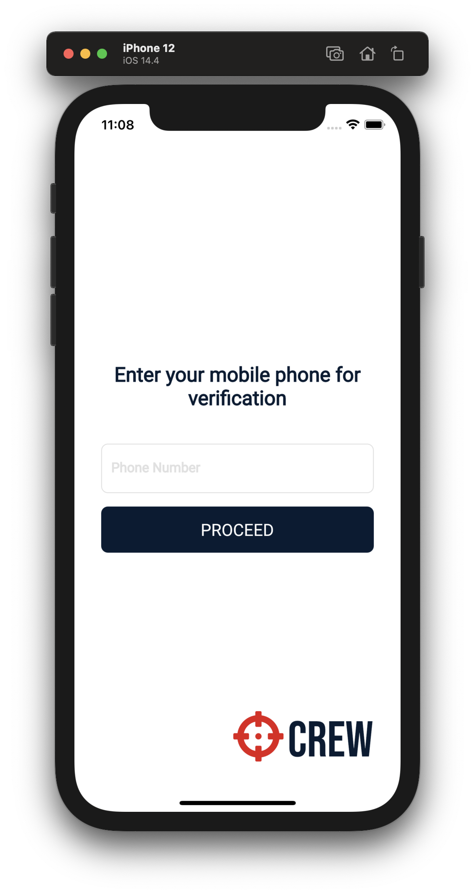
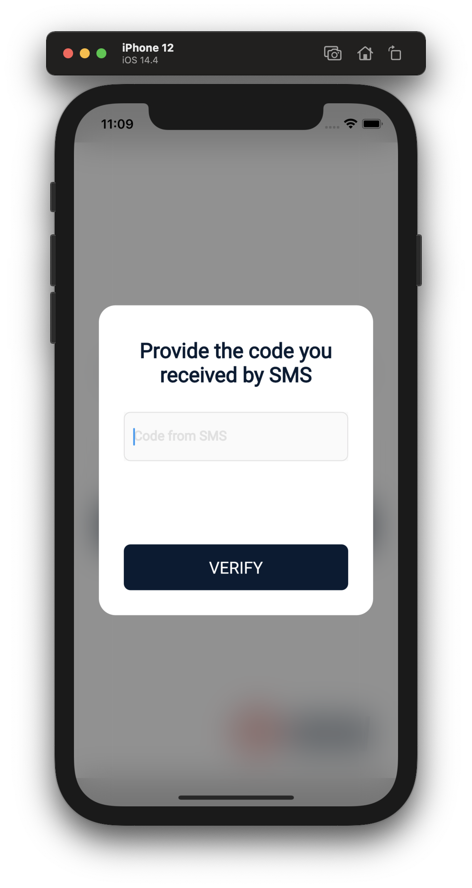
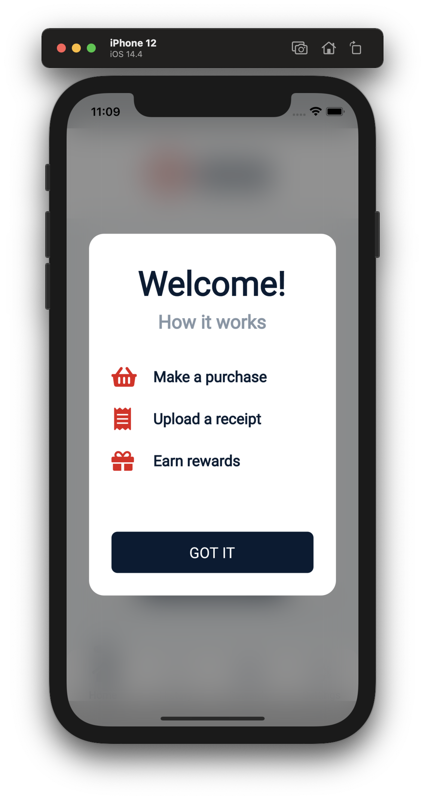
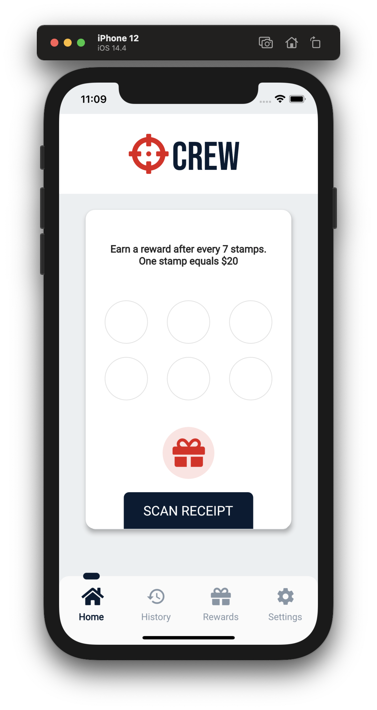
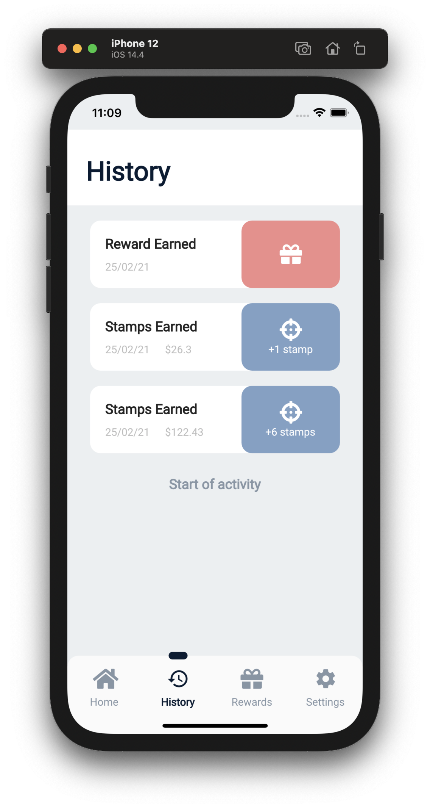

# Crew: A Flutter app using SMS auth with Firebase and Google Vision

This is a mobile app for scanning receipts using phone camera and send the image to `Google API` and process the response. 

It have a reward system based on the money the customer has spent.

## App screenshots

## Log in the app

For logging in the app you should use `+1 555 555 5555` phone number and the `123456` pass code. 

## Set up the app for you

For implementing your own Firebase projects don't forget to import your `GoogleService-Info.plist` for iOS and `google-services.json` for Android. The `bundle/application ID` of the app is `com.ovidiuusvat.crew`.

If you want to configure the app for your own `Google Vision API` account, you shoud replace the file from `assets/data/credentials.json` with your configuration `json` file.

## Contact

For more informations contact the developer: [Ovidiu Usvat](mailto:ovidiu.usvat@yahoo.com?subject=[GitHub]%20Source%20Crew%20Project)

## Support

If you like this open source repo you can encourage me by buying me a coffee(or a tea).

